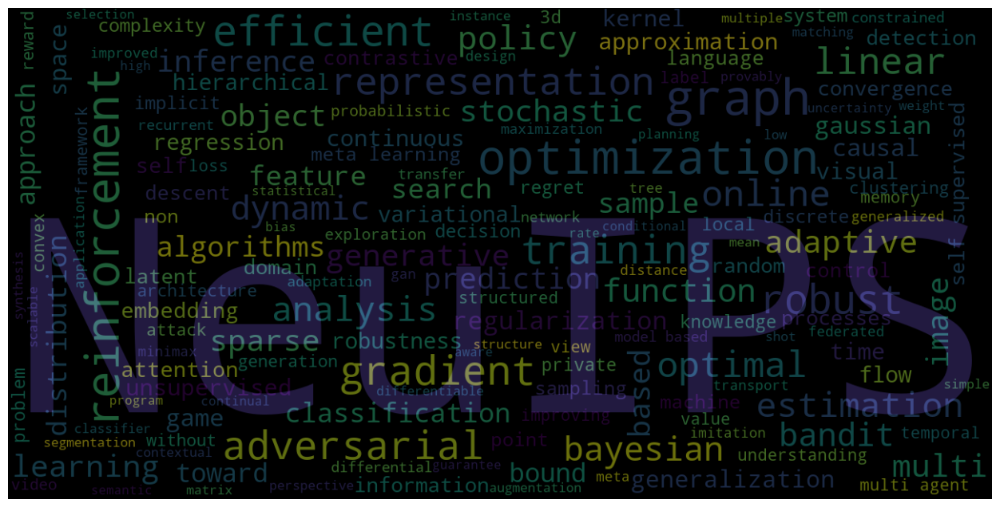
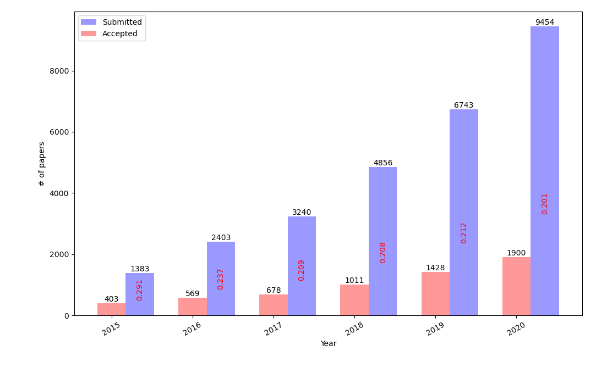
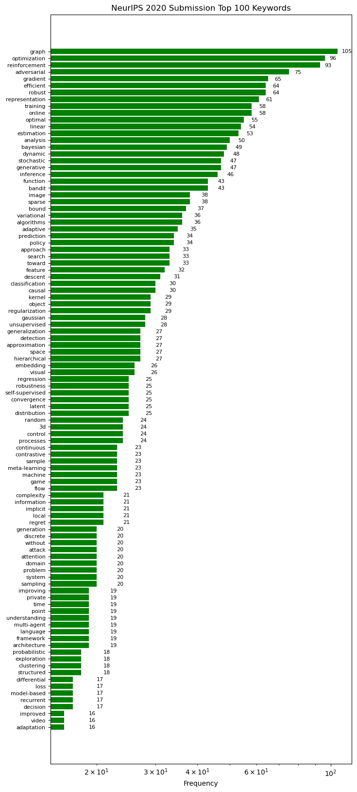

# NeurIPS 2020 Paper Statistics
NeurIPS 2020 Paper Statistics and Visualization of acceptance rate, keywords and authors.

### Descriptions
This repo contains the [data crawler](data/crawler.py) function to collect papers/authors list from neurips webpage and also two jupyter notebooks to visualize the paper statistics. 

  

## NeurIPS 2020 Acceptance rate (2015~2020)

- The acceptance rate of NeurIPS 2020 is  about 20%.

  

## NeurIPS 2020 Paper Keywords statistics
- [Accepted Paper list](https://nips.cc/Conferences/2020/AcceptedPapersInitial)

-  Top keywords 
   - 'graph', 'optimization', 'reinforcement', 'adversarial', 'gradient', 'efficient', 'robust', 'representation', 'training', 

  

## Analysis and Visualization Code (Jupyter Notebook)

- The above data can be obtained from a simple jupyter notebook script.
   - [`wordcloud_keywords.ipynb`](https://github.com/mzolfaghari/NeurIPS-2020-Paper-Statistics/blob/master/AAAI2020_paper_statistics.ipynb)

## Prerequisites
- python3.5
- [wordcloud](https://pypi.org/project/wordcloud/)
- [matplotlib](https://matplotlib.org/)

Codes from:
. [`CVPR-2019-Paper-Statistics`](https://github.com/hoya012/CVPR-2019-Paper-Statistics)
. [`ICCV-2019-Paper-Statistics`](https://github.com/hoya012/ICCV-2019-Paper-Statistics)
. [`NeurIPS-2019-Paper-Statistics`](https://github.com/hoya012/NeurIPS-2019-Paper-Statistics)
. ['AAAI-2020-Paper-Statistics'](https://raw.githubusercontent.com/hoya012/AAAI-2020-Paper-Statistics)
